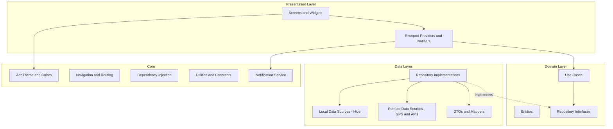
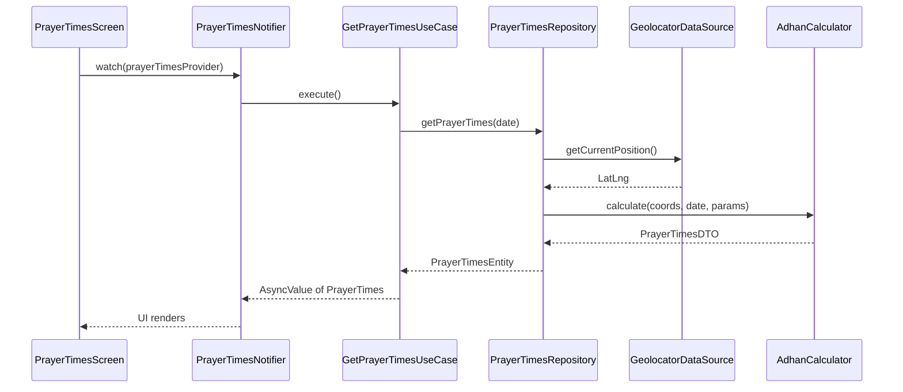
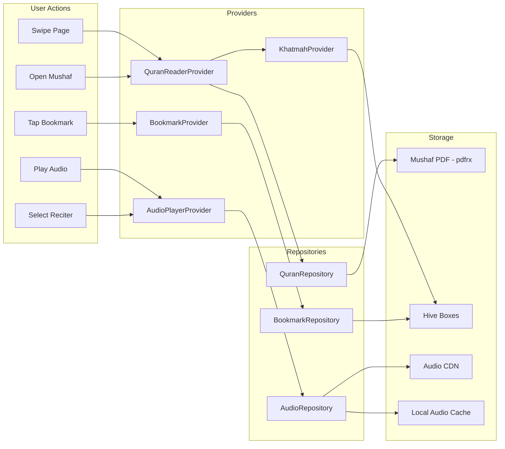

# Mesk Islamic App -- Implementation Plan

## 1. Tech Stack

### Core Framework

- **Flutter 3.27+** (latest stable) with Dart 3.6+
- **Target platforms**: Android (API 21+) and iOS (15+)

### State Management

- **flutter_riverpod + riverpod_annotation** -- compile-safe, testable, fits clean architecture with code generation

### Key Packages


| Category         | Package                                                   | Purpose                                                                          |
| ---------------- | --------------------------------------------------------- | -------------------------------------------------------------------------------- |
| Prayer Times     | `adhan` (^1.0.2)                                          | Accurate prayer time calculations (supports all madhabs and calculation methods) |
| Location         | `geolocator` (^13.0.2)                                    | GPS location for prayer times                                                    |
| Geocoding        | `geocoding` (^3.0.0)                                      | Reverse geocode for city name display                                            |
| Notifications    | `awesome_notifications` (^0.9.3)                          | Scheduled push notifications with custom sounds                                  |
| Local Storage    | `hive_flutter` (^1.1.0) + `hive` (^2.2.3)                 | Structured local persistence (settings, history, progress)                       |
| Preferences      | `shared_preferences` (^2.3.4)                             | Lightweight key-value settings                                                   |
| DI / Code Gen    | `riverpod_generator`, `build_runner`, `json_serializable` | Boilerplate reduction                                                            |
| Fonts            | `google_fonts` (^6.2.1)                                   | Amiri / Scheherazade New for Arabic text                                         |
| Haptics          | `vibration` (^2.0.0)                                      | Tasbih haptic feedback                                                           |
| Intl             | `intl` (^0.19.0)                                          | Date/time formatting, localization                                               |
| SVG              | `flutter_svg` (^2.0.16)                                   | Islamic geometric pattern assets                                                 |
| PDF Viewer       | `pdfrx` (^2.2.24)                                         | High-performance Mushaf PDF rendering built on PDFium (225K+ downloads)          |
| Audio Player     | `just_audio` (^0.10.5)                                    | Quran reciter audio streaming with loop, clip, playlist support                  |
| Background Audio | `just_audio_background` (^0.0.1-beta.17)                  | Background playback and media notification controls for reciters                 |
| HTTP Client      | `dio` (latest)                                            | Download Mushaf PDF, fetch reciter audio URLs                                    |
| File System      | `path_provider` (latest)                                  | App documents directory for downloaded Mushaf PDF and audio cache                |
| Permissions      | `permission_handler` (^11.3.1)                            | Location and notification permissions                                            |


### Dev Dependencies

- `flutter_lints`, `build_runner`, `hive_generator`, `json_serializable`, `riverpod_generator`, `riverpod_lint`

---

## 2. System Architecture




### Data Flow (Example: Prayer Times)




### Data Flow (Quran Reader with Audio)



---

## 3. Folder Structure

```
mesk_islamic_app/
├── android/
│   └── app/src/main/res/raw/       # Custom adhan sound files (.mp3)
├── ios/
├── assets/
│   ├── fonts/                       # Fallback Arabic fonts if needed
│   ├── images/
│   │   ├── patterns/                # Islamic geometric SVG patterns
│   │   ├── icons/                   # Crescent, star, mosque SVGs
│   │   └── splash/                  # Splash screen assets
│   ├── data/
│   │   ├── athkar_morning.json      # Morning Athkar dataset
│   │   ├── athkar_evening.json      # Evening Athkar dataset
│   │   ├── surahs.json             # 114 surahs metadata (name, verses, pages, juz)
│   │   ├── juz_metadata.json       # 30 juz with page ranges
│   │   └── reciters.json           # Available reciters (name, style, base URL)
│   ├── quran/
│   │   └── quran_madani.pdf        # King Fahd Complex Mushaf PDF (604 pages)
│   └── sounds/
│       └── adhan_default.mp3        # Default adhan notification sound
├── lib/
│   ├── main.dart                    # App entry point
│   ├── app.dart                     # MaterialApp configuration, theme, routing
│   │
│   ├── core/
│   │   ├── constants/
│   │   │   ├── app_colors.dart      # Deep green, gold, cream palette
│   │   │   ├── app_text_styles.dart # Arabic + English text styles
│   │   │   ├── app_spacing.dart     # Consistent spacing values
│   │   │   └── app_assets.dart      # Asset path constants
│   │   ├── theme/
│   │   │   ├── app_theme.dart       # ThemeData with Material 3, Islamic palette
│   │   │   └── islamic_decorations.dart  # Reusable pattern/ornament widgets
│   │   ├── services/
│   │   │   ├── notification_service.dart # Awesome notifications wrapper
│   │   │   ├── location_service.dart     # Geolocator wrapper
│   │   │   ├── audio_service.dart        # just_audio + background init wrapper
│   │   │   └── storage_service.dart      # Hive initialization + helpers
│   │   ├── utils/
│   │   │   ├── date_utils.dart      # Hijri date helpers
│   │   │   ├── prayer_utils.dart    # Next prayer calculation helpers
│   │   │   └── arabic_text_utils.dart # RTL and Arabic number formatting
│   │   ├── widgets/
│   │   │   ├── islamic_card.dart    # Card with 12px radius, shadows, accents
│   │   │   ├── islamic_app_bar.dart # Custom app bar with crescent motif
│   │   │   ├── countdown_timer.dart # Reusable countdown widget
│   │   │   ├── progress_indicator.dart # Circular/linear Islamic-styled progress
│   │   │   └── section_header.dart  # Consistent section header
│   │   └── navigation/
│   │       └── bottom_nav_bar.dart  # Bottom tab bar with Islamic icons
│   │
│   ├── features/
│   │   ├── prayer_times/
│   │   │   ├── data/
│   │   │   │   ├── datasources/
│   │   │   │   │   └── prayer_times_local_datasource.dart
│   │   │   │   ├── models/
│   │   │   │   │   └── prayer_times_model.dart          # DTO with JSON serialization
│   │   │   │   └── repositories/
│   │   │   │       └── prayer_times_repository_impl.dart
│   │   │   ├── domain/
│   │   │   │   ├── entities/
│   │   │   │   │   └── prayer_times_entity.dart         # Pure domain object
│   │   │   │   ├── repositories/
│   │   │   │   │   └── prayer_times_repository.dart     # Abstract interface
│   │   │   │   └── usecases/
│   │   │   │       ├── get_prayer_times.dart
│   │   │   │       └── schedule_prayer_notifications.dart
│   │   │   └── presentation/
│   │   │       ├── providers/
│   │   │       │   └── prayer_times_provider.dart       # Riverpod notifier
│   │   │       ├── screens/
│   │   │       │   └── prayer_times_screen.dart
│   │   │       └── widgets/
│   │   │           ├── prayer_time_card.dart
│   │   │           ├── next_prayer_banner.dart
│   │   │           └── prayer_countdown.dart
│   │   │
│   │   ├── athkar/
│   │   │   ├── data/
│   │   │   │   ├── datasources/
│   │   │   │   │   └── athkar_local_datasource.dart     # Loads from JSON assets
│   │   │   │   ├── models/
│   │   │   │   │   └── thikr_model.dart
│   │   │   │   └── repositories/
│   │   │   │       └── athkar_repository_impl.dart
│   │   │   ├── domain/
│   │   │   │   ├── entities/
│   │   │   │   │   └── thikr_entity.dart                # {arabic, translation, count, category}
│   │   │   │   ├── repositories/
│   │   │   │   │   └── athkar_repository.dart
│   │   │   │   └── usecases/
│   │   │   │       ├── get_morning_athkar.dart
│   │   │   │       ├── get_evening_athkar.dart
│   │   │   │       └── schedule_athkar_reminder.dart
│   │   │   └── presentation/
│   │   │       ├── providers/
│   │   │       │   └── athkar_provider.dart
│   │   │       ├── screens/
│   │   │       │   ├── athkar_home_screen.dart           # Morning/Evening selector
│   │   │       │   └── athkar_list_screen.dart           # Scrollable thikr list
│   │   │       └── widgets/
│   │   │           ├── thikr_card.dart                   # Arabic + translation + tap counter
│   │   │           └── athkar_progress_bar.dart
│   │   │
│   │   ├── quran/
│   │   │   ├── data/
│   │   │   │   ├── datasources/
│   │   │   │   │   ├── quran_local_datasource.dart      # Hive for progress, bookmarks, khatmah
│   │   │   │   │   └── quran_audio_datasource.dart      # Reciter audio URL resolution + cache
│   │   │   │   ├── models/
│   │   │   │   │   ├── surah_model.dart                 # Surah metadata DTO
│   │   │   │   │   ├── bookmark_model.dart              # Bookmark DTO with Hive adapter
│   │   │   │   │   ├── khatmah_model.dart               # Khatmah plan DTO with Hive adapter
│   │   │   │   │   ├── reciter_model.dart               # Reciter info DTO
│   │   │   │   │   └── reading_progress_model.dart      # Page/surah progress DTO
│   │   │   │   └── repositories/
│   │   │   │       ├── quran_repository_impl.dart        # Mushaf PDF + metadata
│   │   │   │       ├── bookmark_repository_impl.dart     # Bookmark CRUD
│   │   │   │       └── audio_repository_impl.dart        # Reciter streaming
│   │   │   ├── domain/
│   │   │   │   ├── entities/
│   │   │   │   │   ├── surah_entity.dart                # {number, nameAr, nameEn, verses, startPage, endPage, juz}
│   │   │   │   │   ├── bookmark_entity.dart             # {id, page, surahNumber, title, color, createdAt}
│   │   │   │   │   ├── khatmah_entity.dart              # {id, totalDays, startDate, currentPage, dailyPages}
│   │   │   │   │   ├── reciter_entity.dart              # {id, nameAr, nameEn, style, audioBaseUrl}
│   │   │   │   │   └── reading_progress_entity.dart     # {lastPage, pagesReadToday, totalPagesRead, streak}
│   │   │   │   ├── repositories/
│   │   │   │   │   ├── quran_repository.dart             # Abstract: PDF access, surah list
│   │   │   │   │   ├── bookmark_repository.dart          # Abstract: bookmark CRUD
│   │   │   │   │   └── audio_repository.dart             # Abstract: reciter list, audio URLs
│   │   │   │   └── usecases/
│   │   │   │       ├── get_surahs.dart
│   │   │   │       ├── manage_bookmarks.dart             # Add, remove, list, go-to bookmark
│   │   │   │       ├── manage_khatmah.dart               # Create plan, get daily wird, mark complete
│   │   │   │       ├── get_reciters.dart                 # List available reciters
│   │   │   │       ├── play_recitation.dart              # Stream audio for page/surah
│   │   │   │       ├── update_reading_progress.dart
│   │   │   │       └── get_daily_goal_status.dart
│   │   │   └── presentation/
│   │   │       ├── providers/
│   │   │       │   ├── quran_reader_provider.dart        # PDF page state, current page, zoom
│   │   │       │   ├── bookmark_provider.dart            # Bookmark list + CRUD actions
│   │   │       │   ├── khatmah_provider.dart             # Khatmah plan state + daily wird
│   │   │       │   ├── audio_player_provider.dart        # Reciter playback state + controls
│   │   │       │   └── quran_home_provider.dart          # Home screen aggregated state
│   │   │       ├── screens/
│   │   │       │   ├── quran_home_screen.dart            # Tab in bottom nav: khatmah + browse
│   │   │       │   ├── mushaf_reader_screen.dart         # Full-screen PDF reader
│   │   │       │   ├── surah_index_screen.dart           # Browse by surah list
│   │   │       │   ├── juz_index_screen.dart             # Browse by juz list
│   │   │       │   └── bookmarks_screen.dart             # Saved bookmarks list
│   │   │       └── widgets/
│   │   │           ├── mushaf_page_view.dart             # pdfrx PDF viewer wrapper
│   │   │           ├── reader_top_bar.dart               # Overlay: page number, surah name, close
│   │   │           ├── reader_bottom_bar.dart            # Overlay: audio controls, bookmark btn, page slider
│   │   │           ├── audio_player_bar.dart             # Mini player: play/pause, reciter name, progress
│   │   │           ├── reciter_picker_sheet.dart         # Bottom sheet to choose reciter
│   │   │           ├── bookmark_fab.dart                 # Floating bookmark add button
│   │   │           ├── bookmark_list_tile.dart           # Bookmark entry with page, surah, color
│   │   │           ├── surah_list_tile.dart              # Surah entry with number, name, verse count
│   │   │           ├── juz_list_tile.dart                # Juz entry with number, page range
│   │   │           ├── khatmah_setup_dialog.dart         # Dialog to create/edit khatmah plan
│   │   │           ├── daily_wird_card.dart              # Today's reading portion card
│   │   │           └── reading_stats_card.dart           # Progress stats, streak, pages read
│   │   │
│   │   ├── tasbih/
│   │   │   ├── data/
│   │   │   │   ├── datasources/
│   │   │   │   │   └── tasbih_local_datasource.dart     # Hive for history
│   │   │   │   ├── models/
│   │   │   │   │   └── tasbih_session_model.dart
│   │   │   │   └── repositories/
│   │   │   │       └── tasbih_repository_impl.dart
│   │   │   ├── domain/
│   │   │   │   ├── entities/
│   │   │   │   │   └── tasbih_session_entity.dart
│   │   │   │   ├── repositories/
│   │   │   │   │   └── tasbih_repository.dart
│   │   │   │   └── usecases/
│   │   │   │       ├── save_tasbih_session.dart
│   │   │   │       └── get_tasbih_history.dart
│   │   │   └── presentation/
│   │   │       ├── providers/
│   │   │       │   └── tasbih_provider.dart
│   │   │       ├── screens/
│   │   │       │   └── tasbih_screen.dart
│   │   │       └── widgets/
│   │   │           ├── tasbih_counter_display.dart       # Large circular counter
│   │   │           ├── tasbih_type_selector.dart         # SubhanAllah, etc.
│   │   │           └── tasbih_history_sheet.dart
│   │   │
│   │   └── settings/
│   │       └── presentation/
│   │           ├── providers/
│   │           │   └── settings_provider.dart
│   │           ├── screens/
│   │           │   └── settings_screen.dart
│   │           └── widgets/
│   │               ├── notification_settings_tile.dart
│   │               └── calculation_method_picker.dart
│   │
│   └── generated/                   # Riverpod / JSON generated files
│
├── test/
│   ├── features/
│   │   ├── prayer_times/
│   │   ├── athkar/
│   │   ├── quran/
│   │   └── tasbih/
│   └── core/
│
├── pubspec.yaml
├── analysis_options.yaml
└── README.md
```

---

## 4. Step-by-Step Execution Phases

### Phase 1: Project Scaffolding and Core Setup

**Goal**: Runnable shell app with theme, navigation, and services initialized.

**Steps**:

1. Create Flutter project via `flutter create` with org `com.mesk.islamic`
2. Configure `pubspec.yaml` with all dependencies listed in the tech stack
3. Set up `analysis_options.yaml` with `flutter_lints` and strict rules
4. Create `lib/core/constants/app_colors.dart`:
  - `primaryGreen = Color(0xFF1B5E20)`
  - `goldAccent = Color(0xFFFFD700)`
  - `creamBackground = Color(0xFFF5F5DC)`
  - `darkText = Color(0xFF2E2E2E)`
  - `lightGold = Color(0xFFFFF8E1)`
5. Create `lib/core/constants/app_text_styles.dart` -- define `arabicHeading` (Amiri, 28sp), `arabicBody` (Amiri, 20sp), `englishHeading` (Roboto, 22sp), `englishBody` (Roboto, 16sp)
6. Create `lib/core/theme/app_theme.dart` -- `ThemeData` with Material 3, `ColorScheme.fromSeed(seedColor: primaryGreen)`, override `scaffoldBackgroundColor` to cream, `cardTheme` with 12px rounded corners and gentle elevation (2.0)
7. Create `lib/core/widgets/islamic_card.dart` -- reusable `IslamicCard` widget wrapping `Card` with consistent 12px `BorderRadius`, subtle gold border, 2dp shadow
8. Create `lib/core/navigation/bottom_nav_bar.dart` -- `BottomNavigationBar` with 4 tabs: Prayer Times (mosque icon), Athkar (book icon), Quran (menu_book icon), Tasbih (radio_button_checked icon). Use gold for selected, grey for unselected
9. Create `lib/app.dart` -- `MaterialApp` with theme, home as shell screen with `IndexedStack` + bottom nav
10. Create `lib/main.dart` -- initialize Hive, notification service, wrap with `ProviderScope`
11. Create `lib/core/services/storage_service.dart` -- Hive initialization, register adapters, provide box access
12. Create `lib/core/services/notification_service.dart` -- `AwesomeNotifications` init, channel for prayer (importance high, custom sound), channel for athkar (importance default)
13. Create `lib/core/services/location_service.dart` -- request permission, get current position, cache last known location

### Phase 2: Prayer Times Feature

**Goal**: Display accurate prayer times based on location with countdown to next prayer.

**Steps**:

1. Create `lib/features/prayer_times/domain/entities/prayer_times_entity.dart`:
  - Fields: `fajr`, `sunrise`, `dhuhr`, `asr`, `maghrib`, `isha` (all `DateTime`), `date`, `locationName`, `calculationMethod`
2. Create `lib/features/prayer_times/domain/repositories/prayer_times_repository.dart`:
  - Abstract: `Future<PrayerTimesEntity> getPrayerTimes(DateTime date)`, `Future<void> cacheSettings(PrayerSettings)`
3. Create `lib/features/prayer_times/domain/usecases/get_prayer_times.dart`:
  - Inject repository, call `getPrayerTimes`, return entity
4. Create `lib/features/prayer_times/data/models/prayer_times_model.dart`:
  - DTO with `fromAdhan(PrayerTimes adhanResult)` factory, `toEntity()` mapper
5. Create `lib/features/prayer_times/data/repositories/prayer_times_repository_impl.dart`:
  - Use `geolocator` to get coords, pass to `adhan` package's `PrayerTimes(coordinates, date, params)`, cache result in Hive for offline
  - Support `CalculationMethod`: `ummAlQura`, `egyptian`, `karachi`, `muslimWorldLeague`, etc.
  - Support Madhab selection (Shafi/Hanafi) for Asr time
6. Create `lib/features/prayer_times/presentation/providers/prayer_times_provider.dart`:
  - `AsyncNotifier` that exposes `PrayerTimesEntity`, auto-refreshes at midnight, exposes `nextPrayer` and `timeUntilNext` computed values
7. Create `lib/features/prayer_times/presentation/screens/prayer_times_screen.dart`:
  - Top banner: city name, Hijri date, next prayer name + countdown timer
  - Below: 5 `PrayerTimeCard` widgets in a `Column`, each showing prayer name (Arabic + English), time, and active/upcoming/past state indicated by color
  - Floating geometric pattern SVG as background decoration (low opacity)
8. Create `lib/features/prayer_times/presentation/widgets/prayer_time_card.dart`:
  - `IslamicCard` with prayer icon (sun position), Arabic name, English name, formatted time
  - Active prayer: gold left border + green background tint
  - Past prayer: greyed text
9. Create `lib/features/prayer_times/presentation/widgets/next_prayer_banner.dart`:
  - Large card at top: crescent moon icon, "Next Prayer" label, prayer name in Arabic, countdown `HH:MM:SS` using `Stream.periodic`
10. Create `lib/features/prayer_times/domain/usecases/schedule_prayer_notifications.dart`:
  - Schedule 5 daily notifications using `awesome_notifications`, allow advance notice (5min/10min/15min configurable), custom adhan sound for audio channel

### Phase 3: Athkar Feature

**Goal**: Morning and evening Athkar with Arabic text, translations, per-thikr counter, and reminder notifications.

**Steps**:

1. Create `assets/data/athkar_morning.json` and `assets/data/athkar_evening.json`:
  - Schema: `[{ "id": 1, "arabic": "...", "translation": "...", "transliteration": "...", "source": "Bukhari", "repeatCount": 3, "category": "morning" }]`
  - Populate with authentic morning (30+) and evening (30+) athkar from Hisn al-Muslim
2. Create `lib/features/athkar/domain/entities/thikr_entity.dart`:
  - Fields: `id`, `arabic`, `translation`, `transliteration`, `source`, `repeatCount`, `category`
3. Create `lib/features/athkar/data/datasources/athkar_local_datasource.dart`:
  - Load JSON from assets, parse into models, cache in memory
4. Create `lib/features/athkar/data/models/thikr_model.dart`:
  - `fromJson` factory, `toEntity()` mapper
5. Create `lib/features/athkar/domain/usecases/get_morning_athkar.dart` and `get_evening_athkar.dart`:
  - Return `List<ThikrEntity>` filtered by category
6. Create `lib/features/athkar/presentation/providers/athkar_provider.dart`:
  - `AsyncNotifier` for athkar list, `StateNotifier` for per-thikr completion counter, tracks overall progress (completed/total)
7. Create `lib/features/athkar/presentation/screens/athkar_home_screen.dart`:
  - Two large `IslamicCard` buttons: "Morning Athkar" (sunrise icon) and "Evening Athkar" (sunset icon)
  - Show completion status if started today
8. Create `lib/features/athkar/presentation/screens/athkar_list_screen.dart`:
  - Vertical `ListView.builder` of `ThikrCard` widgets
  - Top progress bar showing X/Y athkar completed
  - Each card is tappable to decrement remaining count
9. Create `lib/features/athkar/presentation/widgets/thikr_card.dart`:
  - Arabic text (RTL, Amiri font, large), translation below (LTR, Roboto, smaller, grey)
  - Source reference (italic, small)
  - Circular counter badge showing remaining repeats; tap anywhere to decrement; green check when done
  - Gentle scale animation on tap
10. Create `lib/features/athkar/domain/usecases/schedule_athkar_reminder.dart`:
  - Schedule morning reminder (default: after Fajr + 15min) and evening reminder (default: after Asr + 15min), configurable in settings

### Phase 4: Quran Reader Feature (Inspired by [Khatmah](https://play.google.com/store/apps/details?id=com.khatmah.android))

**Goal**: Full Mushaf PDF reader with page-by-page reading, bookmarks, multiple audio reciters, Khatmah (completion plan), and surah/juz browsing.

**Sub-phase 4A: Data Layer -- Mushaf PDF, Metadata, and Storage**

1. Create `assets/data/surahs.json`:
  - Schema: `[{ "number": 1, "nameArabic": "الفاتحة", "nameEnglish": "Al-Fatiha", "versesCount": 7, "startPage": 1, "endPage": 1, "revelationType": "Meccan", "juzNumber": 1 }]`
  - All 114 surahs with accurate page numbers matching the King Fahd Complex Madani Mushaf (604 pages)
2. Create `assets/data/juz_metadata.json`:
  - Schema: `[{ "number": 1, "nameArabic": "الم", "startPage": 1, "endPage": 21 }]`
  - All 30 juz with their page ranges
3. Create `assets/data/reciters.json`:
  - Schema: `[{ "id": "mishary_alafasy", "nameArabic": "مشاري العفاسي", "nameEnglish": "Mishary Alafasy", "style": "Murattal", "audioBaseUrl": "https://cdn.islamic.network/quran/audio-surah/128/ar.alafasy/", "surahFormat": "{surahNumber}.mp3" }]`
  - Include 8-10 popular reciters: Mishary Alafasy, Abdul Basit, Al-Husary, Al-Minshawi, Maher Al-Muaiqly, Saud Al-Shuraim, Abdul Rahman Al-Sudais, Saad Al-Ghamdi
  - Use `cdn.islamic.network` or `server8.mp3quran.net` as audio sources (free, no auth required)
4. Bundle `assets/quran/quran_madani.pdf`:
  - High-quality Mushaf PDF from King Fahd Quran Complex (public domain, used by QuranAndroid project)
  - Alternative: download on first launch from a CDN to reduce APK size (~30-50MB PDF)
5. Create `lib/features/quran/data/models/bookmark_model.dart`:
  - Fields: `id` (UUID), `page`, `surahNumber`, `surahNameArabic`, `title` (user-provided or auto "Page X - Surah Y"), `colorHex` (bookmark ribbon color), `createdAt`
  - Hive `TypeAdapter` with `typeId: 1`
  - `toEntity()` and `fromEntity()` mappers
6. Create `lib/features/quran/data/models/khatmah_model.dart`:
  - Fields: `id`, `totalDays`, `startDate`, `dailyPages` (computed: 604 / totalDays rounded up), `completedPages` (list of page numbers), `lastReadDate`, `isActive`
  - Hive `TypeAdapter` with `typeId: 2`
7. Create `lib/features/quran/data/models/reading_progress_model.dart`:
  - Fields: `lastPageRead`, `pagesReadToday`, `lastReadDate`, `totalPagesRead`, `streakDays`
  - Hive `TypeAdapter` with `typeId: 3`
8. Create `lib/features/quran/data/datasources/quran_local_datasource.dart`:
  - Load surah/juz metadata from JSON assets (cached in memory after first load)
  - Hive boxes: `bookmarks_box`, `khatmah_box`, `quran_progress_box`
  - CRUD methods for bookmarks, khatmah plans, and reading progress
  - `getMushafPath()` -- returns path to PDF (asset or downloaded file)
9. Create `lib/features/quran/data/datasources/quran_audio_datasource.dart`:
  - Load reciters from JSON asset
  - Resolve audio URL for a given surah and reciter: `{reciter.audioBaseUrl}{surahNumber}.mp3`
  - Cache audio files locally in app documents directory using `dio` + `path_provider`
  - Check if audio is cached before streaming

**Sub-phase 4B: Domain Layer -- Entities, Repositories, Use Cases**

1. Create domain entities (pure Dart, no dependencies):
  - `surah_entity.dart`: `{ number, nameArabic, nameEnglish, versesCount, startPage, endPage, revelationType, juzNumber }`
    - `bookmark_entity.dart`: `{ id, page, surahNumber, surahNameArabic, title, color, createdAt }`
    - `khatmah_entity.dart`: `{ id, totalDays, startDate, dailyPages, completedPages, lastReadDate, isActive, progress (computed %) }`
    - `reciter_entity.dart`: `{ id, nameArabic, nameEnglish, style, audioBaseUrl }`
    - `reading_progress_entity.dart`: `{ lastPageRead, pagesReadToday, totalPagesRead, streakDays, lastReadDate }`
2. Create abstract repository interfaces:
  - `quran_repository.dart`: `getSurahs()`, `getJuzList()`, `getMushafPdfPath()`, `getSurahForPage(int page)`, `updateProgress(int page)`
    - `bookmark_repository.dart`: `getBookmarks()`, `addBookmark(BookmarkEntity)`, `removeBookmark(String id)`, `getBookmarkForPage(int page)`
    - `audio_repository.dart`: `getReciters()`, `getAudioUrl(String reciterId, int surahNumber)`, `isAudioCached(...)`, `cacheAudio(...)`
3. Create use cases:
  - `get_surahs.dart` -- returns all 114 surahs with juz grouping
    - `manage_bookmarks.dart` -- add/remove/list/check-exists for bookmarks
    - `manage_khatmah.dart` -- create new khatmah plan (specify days: 30, 60, 90, or custom), compute daily wird (page range for today), mark pages as read, check if today's wird is complete
    - `get_reciters.dart` -- return available reciters list
    - `play_recitation.dart` -- resolve audio URL, check cache, return playable source
    - `update_reading_progress.dart` -- called when user reads a page: update lastPage, increment daily counter, update streak
    - `get_daily_goal_status.dart` -- compare today's pages vs khatmah daily wird

**Sub-phase 4C: Presentation Layer -- Screens, Providers, Widgets**

1. Create `lib/features/quran/presentation/providers/quran_reader_provider.dart`:
  - State: `{ currentPage, totalPages, currentSurahName, isOverlayVisible, zoomLevel }`
    - `PdfViewerController` integration from `pdfrx`
    - `goToPage(int page)`, `goToSurah(int surahNumber)`, `toggleOverlay()`, `onPageChanged(int page)` (auto-updates progress)
2. Create `lib/features/quran/presentation/providers/bookmark_provider.dart`:
  - `AsyncNotifier` exposing `List<BookmarkEntity>` from repository
    - `addBookmark(int page, String? title, Color color)`, `removeBookmark(String id)`, `isPageBookmarked(int page)`
3. Create `lib/features/quran/presentation/providers/khatmah_provider.dart`:
  - State: active khatmah plan, today's wird page range, completion percentage, days remaining
    - `createKhatmah(int totalDays)`, `markPageRead(int page)`, `getTodaysWird()` -- returns `{startPage, endPage, pagesRemaining}`
    - `deleteKhatmah()`, `getKhatmahHistory()`
4. Create `lib/features/quran/presentation/providers/audio_player_provider.dart`:
  - Wraps `just_audio` `AudioPlayer` instance
    - State: `{ isPlaying, currentReciter, currentSurah, position, duration, buffering }`
    - `play(int surahNumber)`, `pause()`, `resume()`, `stop()`, `selectReciter(ReciterEntity)`, `seekTo(Duration)`
    - Auto-advances to next surah when current finishes (optional)
    - Persists selected reciter in shared_preferences
5. Create `lib/features/quran/presentation/screens/quran_home_screen.dart`:
  - This is the main Quran tab in the bottom navigation
    - Top section: `DailyWirdCard` -- if khatmah active, show today's reading portion with "Continue Reading" button; if no khatmah, show "Start Khatmah" button
    - Middle: `ReadingStatsCard` -- last page read, streak, total pages
    - Bottom: Two navigation buttons -- "Browse by Surah" and "Browse by Juz"
    - FAB or button: "Open Mushaf" to jump to last read page
6. Create `lib/features/quran/presentation/screens/mushaf_reader_screen.dart`:
  - **Full-screen immersive reader** using `pdfrx` `PdfViewer` widget
    - RTL page order (right-to-left swipe to advance, matching physical Mushaf)
    - Tap center to toggle top/bottom overlay bars
    - `reader_top_bar.dart`: current page number (Arabic numerals), current surah name, close button, bookmark indicator
    - `reader_bottom_bar.dart`: page slider (drag to jump), audio play/pause button, reciter name, bookmark add button
    - On page change: call `quranReaderProvider.onPageChanged(page)` to persist progress
    - Double-tap or pinch to zoom
    - Night mode toggle (invert colors for dark reading)
7. Create `lib/features/quran/presentation/screens/surah_index_screen.dart`:
  - `ListView.builder` of all 114 surahs using `SurahListTile`
    - Search bar at top to filter by Arabic or English name
    - Tap a surah to open `MushafReaderScreen` at that surah's start page
    - Each tile: surah number in decorative frame, Arabic name (Amiri, RTL), English name, verse count, revelation type badge (Meccan/Medinan)
8. Create `lib/features/quran/presentation/screens/juz_index_screen.dart`:
  - `ListView.builder` of 30 juz using `JuzListTile`
    - Each tile: Juz number (Arabic ordinal), juz name, page range
    - Tap to open reader at juz start page
9. Create `lib/features/quran/presentation/screens/bookmarks_screen.dart`:
  - List of saved bookmarks sorted by creation date (newest first)
    - Each `BookmarkListTile`: colored ribbon icon, page number, surah name, user title, date added
    - Swipe to delete, tap to open reader at that page
    - Empty state: illustration + "No bookmarks yet" message
10. Create key widgets:
  - `mushaf_page_view.dart`: Wrapper around `PdfViewer.asset()` or `PdfViewer.file()` from `pdfrx`, configured with RTL scroll direction, page-by-page snap, and zoom support
    - `reader_top_bar.dart`: `AnimatedSlide` overlay -- page/surah info, close, night mode toggle
    - `reader_bottom_bar.dart`: `AnimatedSlide` overlay -- page slider, audio mini controls, bookmark FAB
    - `audio_player_bar.dart`: Persistent mini player when audio is active -- reciter name, surah name, play/pause, progress bar, expand to reciter picker
    - `reciter_picker_sheet.dart`: `DraggableScrollableSheet` listing all reciters with avatar, name (Arabic + English), style tag. Selected reciter highlighted with green check
    - `bookmark_fab.dart`: Floating action button that toggles bookmark for current page (filled/outlined icon), with brief SnackBar confirmation
    - `khatmah_setup_dialog.dart`: AlertDialog with duration selector (30/60/90/custom days), shows computed daily pages, start button
    - `daily_wird_card.dart`: `IslamicCard` showing today's reading assignment -- page range, pages remaining, circular progress, "Read Now" button that opens reader at the correct page
    - `reading_stats_card.dart`: Compact stats -- pages read today, reading streak fire icon, total progress bar (X/604 pages)

### Phase 5: Tasbih Counter Feature

**Goal**: Digital counter with haptic feedback, multiple dhikr types, reset, and session history.

**Steps**:

1. Create `lib/features/tasbih/domain/entities/tasbih_session_entity.dart`:
  - Fields: `id`, `dhikrType` (SubhanAllah / Alhamdulillah / AllahuAkbar / LaIlahaIllallah / custom), `count`, `targetCount`, `timestamp`, `duration`
2. Create Hive adapter for `TasbihSessionModel`
3. Create `lib/features/tasbih/data/datasources/tasbih_local_datasource.dart`:
  - Save/load sessions from Hive box `tasbih_history`
4. Create `lib/features/tasbih/domain/usecases/save_tasbih_session.dart` and `get_tasbih_history.dart`
5. Create `lib/features/tasbih/presentation/providers/tasbih_provider.dart`:
  - `StateNotifier` managing: `currentCount`, `selectedDhikr`, `targetCount` (33, 99, 100, custom), haptic enabled flag
  - Methods: `increment()`, `reset()`, `saveSession()`
6. Create `lib/features/tasbih/presentation/screens/tasbih_screen.dart`:
  - Center: large circular counter display (gold ring, green fill, large Arabic numeral)
  - Below counter: dhikr text in Arabic (Amiri, large)
  - Large tap area (entire center circle) -- tap to increment
  - Bottom: dhikr type selector (horizontal chips), reset button, history button
  - Subtle haptic on each tap via `HapticFeedback.lightImpact()`
7. Create `lib/features/tasbih/presentation/widgets/tasbih_counter_display.dart`:
  - `CustomPaint` or `Stack` with circular progress ring showing count/target
  - Animated number change (scale animation)
  - Gold ring progress indicator
8. Create `lib/features/tasbih/presentation/widgets/tasbih_type_selector.dart`:
  - Horizontal `ChoiceChip` row: SubhanAllah, Alhamdulillah, AllahuAkbar, La Ilaha Illallah
  - Arabic text with small English below
9. Create `lib/features/tasbih/presentation/widgets/tasbih_history_sheet.dart`:
  - `DraggableScrollableSheet` showing past sessions: dhikr type, count, date/time
  - Grouped by day

### Phase 6: Settings and Notification Configuration

**Goal**: User-configurable prayer calculation method, notification preferences, Athkar schedules.

**Steps**:

1. Create `lib/features/settings/presentation/screens/settings_screen.dart`:
  - Sections: Prayer Settings, Notification Settings, Athkar Settings, About
2. Create `lib/features/settings/presentation/widgets/calculation_method_picker.dart`:
  - Dropdown/bottom sheet with: Umm Al-Qura, Egyptian, Karachi, MWL, ISNA, etc.
  - Madhab picker: Shafi (standard), Hanafi
3. Create `lib/features/settings/presentation/widgets/notification_settings_tile.dart`:
  - Per-prayer toggle (enable/disable notification)
  - Advance notice: 0, 5, 10, 15 minutes before
  - Sound selection (default adhan, silent, vibrate only)
  - Athkar morning/evening time pickers
4. Create `lib/features/settings/presentation/providers/settings_provider.dart`:
  - Persists to `shared_preferences`, exposes reactive settings to other features

### Phase 7: Islamic UI Polish and Assets

**Goal**: Finalize the visual identity with geometric patterns, decorations, and RTL support.

**Steps**:

1. Create/commission SVG assets in `assets/images/patterns/`:
  - `geometric_border.svg` -- repeating Islamic geometric border pattern
  - `arabesque_corner.svg` -- corner ornament for cards
  - `crescent_star.svg` -- app branding element
  - `mosque_silhouette.svg` -- prayer times background
2. Create `lib/core/theme/islamic_decorations.dart`:
  - `IslamicPatternBackground` -- `CustomPainter` or SVG tiled background at low opacity
  - `IslamicDivider` -- gold line with centered diamond ornament
  - `CrescentHeader` -- header widget with crescent moon + star
3. Update `lib/core/theme/app_theme.dart`:
  - Ensure `textTheme` uses Google Fonts Amiri for `titleLarge`, `headlineMedium` (Arabic)
  - Card shape: `RoundedRectangleBorder(borderRadius: BorderRadius.circular(12))`
  - Elevation: 2 with soft shadow
  - `AppBarTheme`: dark green background, gold icon color
4. RTL Support:
  - Wrap Arabic text sections in `Directionality(textDirection: TextDirection.rtl, ...)`
  - Use `crossAxisAlignment: CrossAxisAlignment.end` for Arabic-heavy layouts
  - Ensure all `ThikrCard` and prayer name displays handle RTL correctly
5. Splash screen: configure `flutter_native_splash` with green background + crescent logo

---

## 5. Technical Specs per Key File

### `lib/main.dart`

- Call `WidgetsFlutterBinding.ensureInitialized()`
- Initialize Hive via `StorageService.init()`
- Initialize `NotificationService.init()` with channels
- Run `ProviderScope(child: MeskApp())`

### `lib/app.dart`

- `MeskApp` extends `ConsumerWidget`
- Returns `MaterialApp` with `theme: AppTheme.light`, `home: HomeShell()`
- `HomeShell` is a `StatefulWidget` with `IndexedStack` of 4 screens + `BottomNavBar`

### `lib/core/services/notification_service.dart`

- `static Future<void> init()` -- initialize awesome_notifications with 2 channels: `prayer_channel` (high importance, custom sound) and `athkar_channel` (default importance)
- `static Future<void> schedulePrayerNotification({prayer, time, advanceMinutes, sound})` -- create scheduled notification
- `static Future<void> scheduleAthkarReminder({type, time})` -- daily repeating notification
- `static Future<void> cancelAll()` and `cancelByChannel(channel)`

### `lib/core/services/location_service.dart`

- `Future<Position> getCurrentPosition()` -- check permission, request if needed, return position
- `Future<String> getCityName(Position pos)` -- reverse geocode to city name
- Cache last position in shared_preferences for offline fallback

### `lib/features/prayer_times/data/repositories/prayer_times_repository_impl.dart`

- Constructor injects `LocationService`, `StorageService`
- `getPrayerTimes(DateTime date)`:
  1. Get coordinates from `LocationService`
  2. Read calculation method from settings (default: UmmAlQura)
  3. Create `adhan.PrayerTimes(coordinates, DateComponents.from(date), params)`
  4. Map to `PrayerTimesModel`, cache in Hive, return `.toEntity()`
- `getNextPrayer(PrayerTimesEntity times)` -- compare current time against all 5, return next upcoming

### `lib/features/athkar/presentation/providers/athkar_provider.dart`

- `athkarListProvider` -- `FutureProvider.family<List<ThikrEntity>, AthkarCategory>` loading from repository
- `athkarProgressProvider` -- `StateNotifierProvider` tracking `Map<int, int>` (thikrId -> remainingCount)
- `overallProgressProvider` -- derived provider computing completed/total percentage
- Reset progress daily (check last reset date on load)

### `lib/features/tasbih/presentation/providers/tasbih_provider.dart`

- State class: `TasbihState { count, targetCount, selectedDhikr, isCompleted, hapticEnabled }`
- `increment()`: if count < target, increment + trigger haptic; if count == target, show completion
- `reset()`: set count to 0, optionally auto-save session
- `saveSession()`: persist to Hive with timestamp
- `selectDhikr(DhikrType)`: change active dhikr, auto-reset count

### `lib/features/tasbih/presentation/widgets/tasbih_counter_display.dart`

- `CustomPaint` circle with:
  - Outer ring: gold (`#FFD700`) stroke showing progress (count/target as arc)
  - Inner fill: dark green gradient
  - Center: count number in large white Arabic numerals (Amiri, 64sp)
- `AnimatedSwitcher` for number transitions
- `GestureDetector` wrapping entire circle for tap-to-increment
- Size: 280x280 logical pixels, responsive to screen

### `lib/features/quran/presentation/screens/mushaf_reader_screen.dart`

- Full-screen `Scaffold` with `extendBodyBehindAppBar: true` and no app bar (custom overlay)
- Body: `Stack` containing:
  1. `MushafPageView` (pdfrx wrapper) filling entire screen
  2. `ReaderTopBar` positioned at top, visibility controlled by `isOverlayVisible` state
  3. `ReaderBottomBar` positioned at bottom, same visibility toggle
  4. `AudioPlayerBar` docked above bottom bar when audio is playing
- `GestureDetector` on the center area to toggle overlay on tap
- `WillPopScope` to save current page on back navigation
- Constructor accepts optional `initialPage` parameter (defaults to last read page)
- Night mode: wraps PDF in `ColorFiltered` with `ColorFilter.matrix` for sepia/dark inversion

### `lib/features/quran/presentation/widgets/mushaf_page_view.dart`

- Wraps `PdfViewer.asset('assets/quran/quran_madani.pdf')` from `pdfrx`
- Configuration:
  - `controller`: `PdfViewerController` from provider (enables programmatic `goToPage`)
  - `params.layoutPages`: custom layout callback to display pages right-to-left (RTL) matching Arabic reading direction
  - `params.pageOverlayBuilder`: optional overlay to show bookmark ribbon on bookmarked pages
  - `params.onPageChanged`: callback to `quranReaderProvider.onPageChanged(page)`
  - `params.enableTextSelection`: false (Mushaf should not allow text selection)
  - Pinch-to-zoom enabled by default through `PdfViewerParams.interactionEndFriction`
- If PDF is downloaded (not bundled), use `PdfViewer.file(path)` instead

### `lib/features/quran/presentation/providers/audio_player_provider.dart`

- Holds a singleton `AudioPlayer` from `just_audio`
- Initialize `JustAudioBackground.init()` in `main.dart` for lock-screen controls
- State class `AudioPlayerState`:
  - `playerStatus` (idle / loading / playing / paused / error)
  - `currentReciter` (ReciterEntity)
  - `currentSurahNumber` (int)
  - `currentSurahName` (String)
  - `position` (Duration)
  - `duration` (Duration)
  - `isBuffering` (bool)
- `playSurah(int surahNumber)`:
  1. Resolve audio URL: `${currentReciter.audioBaseUrl}${surahNumber.toString().padLeft(3, '0')}.mp3`
  2. Check if cached locally (via `audioRepository.isAudioCached`)
  3. If cached, use `player.setFilePath(cachedPath)`; else use `player.setUrl(audioUrl)`
  4. Call `player.play()`
  5. Listen to `player.positionStream` and `player.playerStateStream` to update state
- `selectReciter(ReciterEntity reciter)`: save to shared_preferences, stop current audio, update state
- `dispose()`: call `player.dispose()` in provider's `onDispose`

### `lib/features/quran/data/datasources/quran_audio_datasource.dart`

- `Future<List<ReciterEntity>> getReciters()` -- load from `assets/data/reciters.json`, parse, return
- `String getAudioUrl(String reciterId, int surahNumber)` -- build URL from reciter's base URL + surah number
- `Future<String?> getCachedAudioPath(String reciterId, int surahNumber)` -- check `path_provider.getApplicationDocumentsDirectory()` for `quran_audio/{reciterId}/{surahNumber}.mp3`
- `Future<String> downloadAndCacheAudio(String url, String reciterId, int surahNumber)` -- use `dio` to download, save to cache directory, return local path
- Audio source URLs (free, no API key):
  - `https://cdn.islamic.network/quran/audio-surah/128/{reciterId}/{surahNumber}.mp3`
  - Alternative: `https://server8.mp3quran.net/{reciterPath}/{surahNumber}.mp3`

### `assets/data/reciters.json` (example structure)

```json
[
  {
    "id": "ar.alafasy",
    "nameArabic": "مشاري راشد العفاسي",
    "nameEnglish": "Mishary Rashid Alafasy",
    "style": "Murattal",
    "audioBaseUrl": "https://cdn.islamic.network/quran/audio-surah/128/ar.alafasy/"
  },
  {
    "id": "ar.abdulbasitmurattal",
    "nameArabic": "عبد الباسط عبد الصمد",
    "nameEnglish": "Abdul Basit (Murattal)",
    "style": "Murattal",
    "audioBaseUrl": "https://cdn.islamic.network/quran/audio-surah/128/ar.abdulbasitmurattal/"
  },
  {
    "id": "ar.husary",
    "nameArabic": "محمود خليل الحصري",
    "nameEnglish": "Mahmoud Khalil Al-Husary",
    "style": "Murattal",
    "audioBaseUrl": "https://cdn.islamic.network/quran/audio-surah/128/ar.husary/"
  }
]
```

### `assets/data/athkar_morning.json` (example structure)

```json
[
  {
    "id": 1,
    "arabic": "أَصْبَحْنَا وَأَصْبَحَ الْمُلْكُ لِلَّهِ...",
    "translation": "We have reached the morning and at this very time...",
    "transliteration": "Asbahna wa asbahal mulku lillah...",
    "source": "Muslim",
    "repeatCount": 1,
    "category": "morning",
    "reference": "Hisn Al-Muslim #75"
  }
]
```

---

## 6. Key Architectural Decisions

- **Offline-first**: All data cached locally in Hive. GPS is used for initial setup; cached coordinates serve as fallback. Mushaf PDF is bundled or downloaded once. Audio can be cached for offline playback.
- **No backend required**: This is a fully local app. All athkar data, surah metadata, and prayer calculations happen on-device. Audio streaming uses free public CDNs (islamic.network, mp3quran.net) -- no API keys needed.
- **Riverpod over Bloc**: Simpler for this app's scale, better code generation support, and natural fit for dependency injection without a separate DI framework.
- **awesome_notifications over flutter_local_notifications**: Better support for custom sounds, scheduled notifications, and notification channels on both platforms.
- **adhan package**: Battle-tested prayer time calculation library supporting all major calculation methods and madhabs.
- **pdfrx over syncfusion_flutter_pdfviewer**: MIT-licensed (no commercial license concerns), 225K+ downloads, built on PDFium for fast rendering, supports page-by-page layout customization needed for RTL Mushaf reading. Syncfusion has a proprietary license.
- **just_audio for Quran recitation**: 664K+ downloads, 4100+ likes, supports streaming, caching, background playback via `just_audio_background`, and gapless playlist for continuous surah playback.
- **Bundled PDF vs. download-on-demand**: The plan supports both approaches. Bundling increases APK size by ~30-50MB but guarantees offline use from first launch. Alternatively, downloading on first launch keeps APK small but requires initial internet. Recommend bundling for reliability, with the PDF sourced from the King Fahd Complex (public domain, same source as [Khatmah app](https://play.google.com/store/apps/details?id=com.khatmah.android)).
- **Feature-first structure**: Each feature is self-contained with its own data/domain/presentation layers, enabling parallel development and easy feature addition.
- **Khatmah system design**: The khatmah (Quran completion plan) is modeled after the Khatmah app -- user selects a duration (30/60/90/custom days), the system divides 604 pages evenly and assigns a daily wird (portion). Progress is tracked per-page in Hive, and the daily wird card on the home screen always shows the correct page range for today based on `startDate + (daysSinceStart * dailyPages)`.

